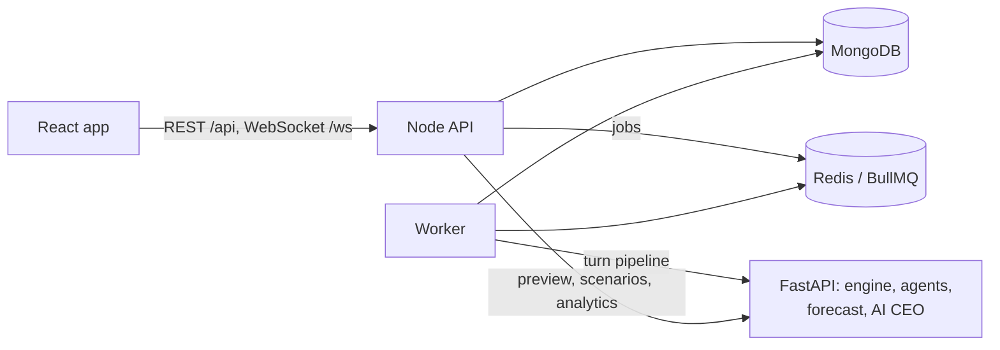

# Stack Forge

A turn-based startup simulator. You create a startup, make monthly decisions (price, marketing, hiring, product investment), and a deterministic simulation engine computes what happens: customers, revenue, costs, cash, churn and market share, against rival companies and market events. LLM agents (customers, competitors) nudge demand within strict bounds, an ML model forecasts next month, and an AI CEO explains the results using only the numbers the engine produced.

**Python calculates, LLMs interpret.** Every financial figure comes from the engine; the same seed and decisions always give the same run, and any simulation can be replayed exactly from its stored turns.

## Architecture



| Directory | Contents |
| --- | --- |
| `frontend/` | React + Vite + TypeScript dashboard |
| `backend/` | Express API, WebSocket, BullMQ worker, MongoDB models |
| `simulation/` | FastAPI service: `engine/` (pure simulation), `app/` (pipeline, agents, advisor, analytics), `ml/` (forecasting), `runner/` (CLI) |
| `shared/` | JSON Schema contracts, generated TS and Python types, industry templates |
| `infrastructure/` | Docker Compose (dev, prod), Caddy config |
| `evaluation/` | Evaluation scripts and result tables |
| `demo/` | The NovaTech demo |
| `docs/` | Specification and design documents |

## Quick start (development)

Needs Node 22+, Python 3.12 and Docker.

```bash
npm install
python -m venv simulation/.venv
simulation/.venv/Scripts/python -m pip install -r simulation/requirements-dev.txt   # macOS/Linux: .venv/bin/python
cp backend/.env.example backend/.env        # set JWT_ACCESS_SECRET
cp frontend/.env.example frontend/.env
cp simulation/.env.example simulation/.env  # optional: LLM_API_KEY (Google Gemini)
docker compose -f infrastructure/docker-compose.dev.yml up -d
(cd simulation && .venv/Scripts/python -m ml.train --sims 500 --quick)

# four terminals
(cd simulation && .venv/Scripts/python -m app.main)
npm run dev:backend
npm run worker -w backend
npm run dev:frontend                         # http://localhost:5173
```

Production: merged pull requests deploy automatically (GitHub Actions → GHCR → the server, with a smoke test and rollback); by hand: `docker compose -f infrastructure/docker-compose.prod.yml --env-file infrastructure/.env.prod up -d --build` — see [docs/deployment.md](docs/deployment.md). API reference: `/api/v1/docs` on a running stack.

Demo (with the stack running): `simulation/.venv/Scripts/python demo/novatech.py`.

All commands, including tests, lint, type generation and evaluation, are in the **Commands** section of [CLAUDE.md](CLAUDE.md).

## Documentation

| Document | Covers |
| --- | --- |
| [SPEC.md](docs/SPEC.md) | The specification |
| [architecture.md](docs/architecture.md) | Services, turn sequence, data flow |
| [database.md](docs/database.md) | Collections, ER diagram, invariants |
| [api.md](docs/api.md) | REST and WebSocket API |
| [simulation.md](docs/simulation.md) | Engine formulas, determinism, replay |
| [agents.md](docs/agents.md) | LLM customer and competitor agents |
| [ml.md](docs/ml.md) | Forecasting dataset, models, results |
| [ai-advisor.md](docs/ai-advisor.md) | AI CEO and the faithfulness check |
| [frontend.md](docs/frontend.md) | Views and design system |
| [deployment.md](docs/deployment.md) | CI/CD, production stack, backups, monitoring |
| [testing.md](docs/testing.md) | Test suites, reliability matrix, evaluation |
| [performance.md](docs/performance.md) | Load tests and observed limits |
