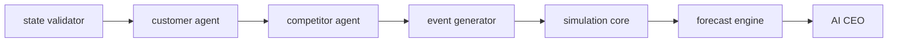

# Agents and the turn pipeline

## Pipeline (LangGraph)

`simulation/app/pipeline/turn.py` builds a LangGraph `StateGraph` with one node per stage, in the order the spec gives:

| Node | Stage reported | What it does |
| --- | --- | --- |
| state validator | `PROCESSING_DECISION` | Turn order, bankruptcy and decision validation (rejections name each field), then the rule-based agent effects used as fallbacks |
| customer agent | `ANALYZING_CUSTOMERS` | Rules in `rules` mode; the LLM in `llm` mode |
| competitor agent | `ANALYZING_COMPETITORS` | As above |
| event generator | `APPLYING_MARKET_EVENT` | `engine.turn_events`: the events this turn starts, from the same seeded stream `run_turn` uses |
| simulation core | `UPDATING_FINANCIAL_MODEL` | `engine.run_turn` with the agents' effects; checks it applied the generated events |
| forecast engine | `GENERATING_FORECAST` | `ml.forecast` on `stateAfter` |
| AI CEO | `AI_CEO_ANALYSIS` | Advisor in ANALYZE mode on the new record ([ai-advisor.md](ai-advisor.md)) |

`graph.stream(..., stream_mode="updates")` yields after each node, and each update becomes one NDJSON stage event. The Node worker relays those to the browser and sends `COMPLETE` once the record is stored.

Python calculates; LLMs interpret. The agents contribute only bounded modifiers that the engine consumes. Every financial figure still comes from the engine.

## Inputs

Agents receive the structured state the spec lists, with money in whole rupees and rates in percent:

- `startup`: cash, revenue, profit, price and the reference price, customers, quality, satisfaction, awareness, share and pressure;
- `market`: segments and active events;
- `competitors`: price, quality, marketing power and share;
- `decision`: each decision with its previous value;
- `recentTurns`: the agents' memory.

**Memory** is bounded. Node sends a summary of the 5 turns before this one with each request (`PipelineTurnRequest.memory`, at most 6 entries), built from stored records. It includes earlier agent reasoning, so the agents can stay consistent from month to month.

## Outputs and validation

| Agent | Returns |
| --- | --- |
| Customer | `sentimentChange`, `demandModifier`, `reasoningSummary` |
| Competitor | `competitorThreat`, `demandModifier`, `reasoningSummary` |

The competitor agent's threat drives competitor reactions in the engine. Fields an agent doesn't produce are 0 in the stored `AgentOutput`.

LLM output is untrusted. Each response goes through these steps in order:

1. **Schema validation.** The response is parsed against a pydantic model, and Gemini is asked for JSON matching that schema.
2. **Range validation.** `sentimentChange` and `demandModifier` must lie in [-1, 1], `competitorThreat` in [0, 1], and the reasoning must be non-empty. NaN or any value out of range rejects the whole response.
3. **Per-turn caps.** Values in range are clamped to the configured caps: `AGENT_DEMAND_CAP` (default 0.15) and `AGENT_SENTIMENT_CAP` (default 0.1). Reasoning is truncated to 600 characters.
4. **Fallback.** On invalid output, timeout (`LLM_TIMEOUT_S`, default 10 s), provider error or no configured key, the agent's rule-based output is used instead. It is stored with `source: "rules_fallback"` and a `fallbackReason` such as `timeout: …`, `invalid_output: demandModifier 1.7 outside [-1.0, 1.0]` or `LLM not configured`.

The engine applies its own last-resort caps as well (±0.3 demand, ±0.2 sentiment).

## Modes and reproducibility

A simulation's `agentMode` is chosen when it starts:

- **`rules`:** the agents are the engine's rule-based functions (`engine.rule_based_agent_effects`).
- **`llm`:** the agents call the LLM.

Either way, the validated `agentEffects` are stored in the turn record. `replay` passes the stored effects back to `run_turn` and never calls the LLM, so an llm-mode simulation replays exactly. A test plays six llm-mode turns with a fake client, round-trips the records through JSON, replays them with no LLM calls, and gets zero mismatches. It also checks that the LLM effects actually changed the outcome compared with rules mode.

## Prompts and prompt versions

System prompts are versioned files, `simulation/app/prompts/<name>/v<N>.md` (`customer_agent`, `competitor_agent`, `advisor`). The highest version is used unless pinned with `PROMPT_VERSION_<NAME>=<N>`; a changed prompt is a new file, never an edit. Every turn record stores the versions it used (`llmUsage.promptVersions`), every LLM call stores its version, and advice stores `promptVersion`.

**Prompt injection.** Founder-written text that reaches a model (startup name, product name, product description, the advisor question) is never part of a prompt's instructions. It is cut to a length limit (names 80 characters, description 300, question 500) and passed with the computed data as one JSON block between `<data>` and `</data>`, with `<` escaped inside the JSON so nothing can close the block early. The system prompts say that everything in the block is data and that instructions found there are not followed. Behind that, the existing safeguards hold even if a model obeys an injection: agent values outside their ranges are rejected (rules are used instead) and values inside are clamped to the per-turn caps; the advisor's figures are checked against the computed data only, never against founder text, so a figure planted in a question cannot be cited. `tests/test_llm_safeguards.py` submits injection attempts and asserts both.

## Cost controls

- **Token usage** is recorded for every call (prompt and completion tokens from the provider, model, prompt version, outcome, latency) in the turn record's `llmUsage.calls` and in advice's `llmCalls`; the backend copies them to the `llmusage` collection with the user, simulation and turn.
- **Per-turn budget** (`LLM_TURN_TOKEN_BUDGET`, default 12,000 tokens, 0 = none): once a turn's calls have spent it, later calls are skipped (agents fall back with `token_budget_exhausted`, the AI CEO is marked unavailable) and `llmUsage.turnBudgetExhausted` is set.
- **Per-user daily quota** (`LLM_USER_DAILY_TOKEN_QUOTA` on the backend, default 200,000 per UTC day, 0 = none): the worker sends the user's remaining allowance with each turn (`tokenAllowance`). At 0 the pipeline makes no LLM call: the turn runs in `rules` mode, the AI CEO is unavailable, and `llmUsage.dailyQuotaExhausted` is set. The dashboard says so, and `GET /account/llm-usage` reports usage and the reset time. On-demand advice uses the same allowance.
- **Agent cache** (`REDIS_URL` on the simulation service; entries live `AGENT_CACHE_TTL_S`, default 7 days): agent outputs are cached under a hash of prompt version, model, system prompt and input. A hit is re-validated, recorded like any other agent effect with `cached: true` and no tokens, and never reaches the provider. The cache fails open: if Redis is down, the agent calls the model.

## Prompt regression evals

`evaluation/prompts/cases.json` is a fixed set of saved pipeline inputs (6 agent and 9 advisor inputs from seeded simulations, 3 of them carrying injection text), built by `evaluation/prompts/build_cases.py`. `evaluation/prompts/run_evals.py` renders each case with the same prompt builders the service uses and checks schema validity, range compliance (and how often answers fall inside the caps) and advisor numeric faithfulness. It runs with a deterministic fake client in CI (every check must pass) and against Gemini through the manual `prompt-evals.yml` workflow. Results: `evaluation/results/prompt-evals-<provider>.md`.

## LLM client

`simulation/app/llm/client.py` is the only module that imports a provider SDK (`google-genai`). It defines:

- `LLMClient`: one method, `generate_json`, returning a dict or raising `LLMError(kind)`;
- `GeminiClient`: JSON-constrained output with a per-request timeout;
- `FakeLLMClient`: scripted responses for tests, so the suites run without an API key.

Swapping providers means adding another implementation and a branch in `create_llm_client`. Each call is logged with its purpose, model, outcome and latency; prompts and keys are not logged.

Configuration (`simulation/.env`):

| Variable | Default |
| --- | --- |
| `LLM_PROVIDER` | `gemini` |
| `LLM_API_KEY` | (empty: agents fall back to rules, advice is unavailable) |
| `LLM_AGENT_MODEL` | `gemini-3.5-flash-lite` |
| `LLM_ADVISOR_MODEL` | `gemini-3.8-flash` |
| `LLM_TIMEOUT_S` | `10` |
| `AGENT_DEMAND_CAP` / `AGENT_SENTIMENT_CAP` | `0.15` / `0.1` |
| `ADVISOR_ON_TURN` | `true` |
