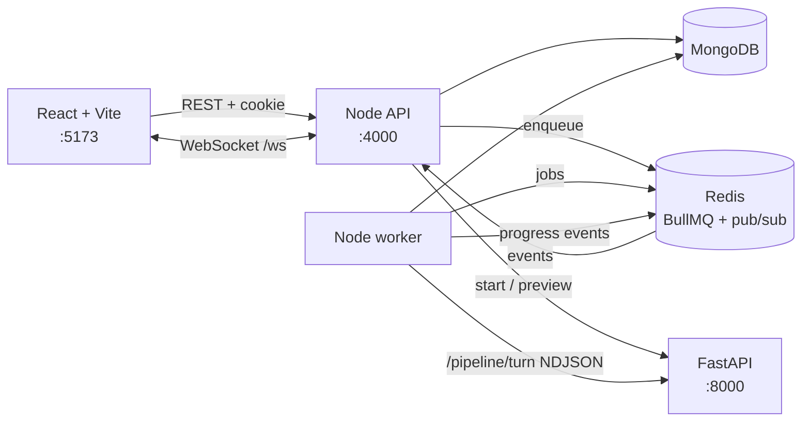
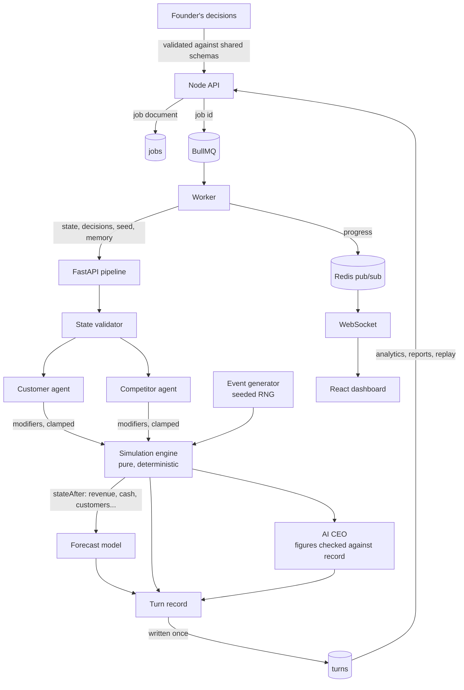

# Architecture

How the services fit together. `docs/SPEC.md` is the specification; [deployment.md](deployment.md) covers the production stack and [database.md](database.md) the collections.

Development topology (each service on the host):



In production a Caddy reverse proxy is the only published service. It terminates HTTPS and routes `/api/*` (prefix stripped) and `/ws` to the API and everything else to the static frontend; MongoDB, Redis, the worker and FastAPI are reachable only on the internal Docker network ([deployment.md](deployment.md)).

## Data flow

Where each kind of data is produced and where it ends up. Financial numbers are produced only by the engine; LLM output enters only as bounded agent modifiers and as text.



## Playing a turn

```mermaid
sequenceDiagram
  participant B as Browser
  participant A as API
  participant Q as Redis (BullMQ, pub/sub)
  participant W as Worker
  participant P as FastAPI
  participant D as MongoDB
  B->>A: POST /simulations/:id/turns {decisions}
  A->>D: insert job QUEUED (unique: one active job per simulation)
  A->>Q: add job (jobId = Mongo id)
  A-->>B: 202 SimulationJob
  W->>Q: take job
  W->>D: QUEUED -> RUNNING
  W->>P: POST /pipeline/turn {state, decisions, configuration, seed}
  P-->>W: stage PROCESSING_DECISION
  W->>Q: publish stage event
  Q-->>A: event
  A-->>B: ws {type: stage}
  P-->>W: stage UPDATING_FINANCIAL_MODEL, then result {record}
  W->>D: validate and insert turn record (append-only)
  W->>D: simulation.currentTurn, status; job COMPLETED
  W->>Q: publish COMPLETE and job events
  A-->>B: ws {type: job, status: COMPLETED}
```

**MongoDB is the source of truth for job status.** BullMQ only schedules execution, and the job's MongoDB id is also its BullMQ id, so enqueuing twice is harmless. The worker is idempotent:

- A job retried after a crash finds its turn already written and completes.
- Any failure before the insert leaves the simulation at its previous turn.
- On startup, the worker re-enqueues active jobs that Redis no longer holds.

**Failure handling:**

| Failure | Behaviour |
| --- | --- |
| Engine unreachable or timed out | Job `FAILED` with `ENGINE_UNAVAILABLE` / `ENGINE_TIMEOUT`; no turn written |
| Invalid record from the engine (schema, turn number, or a `stateBefore` that doesn't continue the stored state) | `ENGINE_CONTRACT_VIOLATION` |
| Redis down when enqueuing | 503 `QUEUE_UNAVAILABLE`, and the job is marked `FAILED` so the lock is released |
| Redis down when publishing progress | Events are dropped (best effort); the browser polls the job instead |

**Turn records** are append-only. A unique `(simulationId, turnNumber)` index rejects a second write, and Mongoose hooks refuse every update path. Current state is always the latest record's `stateAfter`. The `Simulation` document's `currentTurn`, `status` and `activeJobId` are conveniences kept in step by the worker.

**The play screen** (`/simulations/:id`):

- connects to `/ws` and records events per job id, so events that arrive before the POST response returns the job id are not lost;
- falls back to polling `GET /jobs/:id` while the socket is down;
- reconnects with backoff.

**Python side.** The turn pipeline (`simulation/app/pipeline/turn.py`) is a LangGraph graph:

    state validator -> customer agent -> competitor agent -> event generator -> simulation core -> forecast -> AI CEO

Each node is streamed as a stage. Agents are rule-based or LLM-backed, with validation, caps and per-agent fallback ([agents.md](agents.md)). Forecasts come from trained models in `simulation/ml` ([ml.md](ml.md)). The AI CEO's advice is checked for invented figures ([ai-advisor.md](ai-advisor.md)). Every LLM call goes through `app/llm/client.py`.

The frontend's views, routes and design system are described in [frontend.md](frontend.md).

## Shared contracts

`shared/schemas/*.schema.json` (JSON Schema draft-07) are the source of truth for every payload that crosses a service boundary. `npm run generate` produces:

- `shared/generated/ts/index.d.ts`: TypeScript types, imported type-only by the backend and the frontend as `@stackforge/shared`.
- `shared/python/stackforge_shared/models/`: pydantic v2 models with snake_case fields and camelCase aliases, installed into the simulation venv as an editable package.

Runtime validation:

- The backend compiles every schema with Ajv in strict mode, validates request bodies before the controller runs, and checks every response body against its schema before sending it. A mismatching response is a server bug and returns 500 `CONTRACT_VIOLATION`.
- The simulation service validates with the generated pydantic models.
- The browser is a client of the backend rather than a service, so it does not repeat the validation; the backend validates what the browser sends and what it receives.

Enums are generated as string unions in TypeScript and `StrEnum`s in Python. The frontend reads option lists (industries, business models, difficulties) straight from `enums.schema.json` so the UI cannot drift from the contract.

Simulation-facing schemas (`SimulationState`, `Decision`, `DecisionResult`, `DecisionPreview`, `SimulationTurn`, `AgentEffects`, `MarketEvent`, `EventCatalog`) are used by the engine since Milestone 2. `Forecast`, `AIAdvice` and `SimulationJob` are still drafts for Milestones 3–4.

## Industry templates

`shared/templates/events.json` is the market-event catalog. `shared/templates/industries/*.json` hold one `IndustryTemplate` per industry: wizard defaults (business model, capital, price, market size) and the `SimulationParameters` the engine will consume. `shared/templates/difficulty.json` holds the `DifficultyModifiers` for each difficulty level. These are data files, not code branches. Tests in both languages check that each one validates, that every industry has exactly one template, and that segment weights sum to 1.

When a startup is created, the backend snapshots the template parameters and version, the difficulty modifiers and the event catalog into the startup's `configuration`. The engine applies the modifiers itself, so the backend does no simulation arithmetic. `stackforge_shared.templates.build_configuration` does the same snapshot in Python for scripts.

## Backend layout

```text
backend/src
  app.ts            builds the Express app (middleware order, routes)
  server.ts         loads config, connects MongoDB/Redis, listens
  config.ts         environment variables
  contracts.ts      Ajv over shared/schemas
  db.ts             MongoDB (background reconnect) and Redis clients
  http/             authenticate, validate, sanitize, error-handler
  modules/auth      tokens, password rules, user and refresh-token models, service, controller, routes
  modules/startups  template catalog, model, service, controller, routes
  modules/health    dependency probes
```

Controllers validate, call a service and return. Services own the rules and every database query; each startup query includes `ownerId`, and another user's startup is reported as 404 so its existence is not revealed.

Request hardening, in middleware order: request ID and JSON logging (pino-http), Helmet security headers, CORS restricted to `CORS_ORIGIN` with credentials, a JSON body limit (`BODY_LIMIT`, default 100 kB), and rejection of any body key that starts with `$` or contains `.`. As a second layer, Mongoose's `sanitizeFilter` is enabled globally, so trusted server-side operators must be wrapped in `mongoose.trusted()`.

The API starts even when MongoDB or Redis is down. It keeps reconnecting, reports the dependency as `down`, and returns 503 for requests that need the database.

## Logging

Both services write one JSON object per line. Backend request logs carry `requestId` and, after authentication, `userId`. The simulation service logs `requestId` (taken from the incoming `X-Request-Id`) and `engineVersion`. Authorization headers, cookies, passwords and tokens are redacted. Worker and pipeline logs add `simulationId`, `jobId`, `turn`, `engineVersion` and `modelVersion`; when tracing is on, every backend line also carries `traceId`.

## Observability

Prometheus scrapes `/metrics` on the API, the worker (`:9464`) and the simulation service; OpenTelemetry carries one trace per turn from the API request through the BullMQ job (whose trace context is stored on the job document) to FastAPI (W3C `traceparent`), the LangGraph stages and the LLM client; Sentry receives unexpected errors tagged with `requestId`. Grafana shows all of it on one provisioned dashboard. Setup and operation: [deployment.md](deployment.md#observability). The engine stays free of all of this: spans and metrics live in `simulation/app`.

## API versioning and engine versions

Public routes live under `/api/v1`, with OpenAPI documents generated from the shared schemas at `/api/v1/docs`. Each simulation is pinned to the engine version that created it; the simulation service keeps earlier versions importable ([simulation.md](simulation.md#engine-versions)).

## Simulation service

`simulation/app` is the FastAPI transport layer: settings, JSON logging, request-ID middleware, the shared error shape, `GET /health`, the `/engine/*` routes (`app/services/engine_service.py`) and the streaming turn pipeline (`app/pipeline/turn.py`).

`simulation/engine` is the pure simulation engine. Its formulas, determinism design and tests are in [simulation.md](simulation.md):

| Module | Contents |
| --- | --- |
| `turn.py` | `create_initial_state`, `run_turn` |
| `decisions.py` | validation and application |
| `market.py` | segment choice shares, acquisition, churn |
| `finance.py` | revenue and costs |
| `competitors.py` | creation and reactions |
| `events.py` | event sampling and effects |
| `agents.py` | rule-based agent effects |
| `preview.py`, `replay.py` | preview and replay |
| `profiles.py` | model data and tunables |
| `rng.py` | seeded streams |

`simulation/app/analytics` computes everything the dashboard and analytics views show: derived metrics, preview against actual, forecast against actual, and scenario branches. Node and the browser only pass it through and format it. `simulation/ml` holds forecasting: the dataset, training and inference ([ml.md](ml.md)). `simulation/app/{llm,agents,advisor}` hold the LLM client, the agents and the AI CEO. `simulation/runner` holds command-line tools outside the engine: `python -m runner` and the viability check. `tests/test_engine_purity.py` fails the build if it imports web, database, queue, LLM, clock or OS modules, or calls `open`/`print`. Seeded `random.Random` is allowed; every generator comes from `engine/rng.py`.
