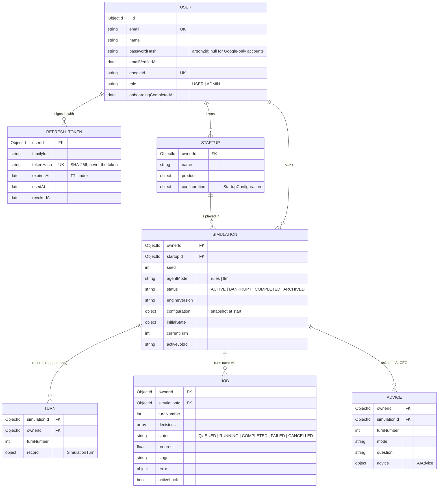

# Database

MongoDB, accessed through Mongoose (`backend/src/modules/**/*.model.ts`). Only the Node API and worker touch it; the simulation service is stateless.

Global settings (`backend/src/db.ts`): `strictQuery`, `sanitizeFilter` (user input can never smuggle query operators; server-side operators are wrapped in `mongoose.trusted`), and a 2.5 s buffer timeout so requests fail fast with 503 while MongoDB is unreachable.

## Collections

| Collection | Purpose | Indexes |
| --- | --- | --- |
| `users` | Accounts. Passwords hashed with argon2id. | `email` unique |
| `refreshtokens` | Rotating refresh tokens; reuse of a used token revokes the family. | `tokenHash` unique, `userId`, `familyId`, TTL on `expiresAt` |
| `startups` | Startup, its `location` (null before Milestone 10) and its `StartupConfiguration` (industry template + difficulty + resolved `locationProfile`; editable until a simulation starts, the location then locked). | `{ownerId, createdAt -1}` |
| `simulations` | Seed, agent mode, engine version, configuration and initial state snapshot. `currentTurn`, `status`, `activeJobId` are conveniences the worker keeps in step. | `{ownerId, startupId, createdAt -1}` |
| `turns` | One `SimulationTurn` per month: `stateBefore`, decisions, events, competitor actions, agent effects, `stateAfter`, forecast, advice. | `{simulationId, turnNumber}` unique, `ownerId` |
| `jobs` | Turn jobs. MongoDB is the source of truth for job status; BullMQ only schedules. Each stores the W3C trace context of the request that queued it. | `ownerId`, `simulationId`, `status`, partial unique `{simulationId}` where `activeLock: true`, partial unique `{ownerId, simulationId, idempotencyKey}` |
| `actiontokens` | Single-use tokens (email verification links, password reset tokens issued after a code check): SHA-256 hash, purpose, expiry, used time. | `tokenHash` unique, `userId`, TTL on `expiresAt` |
| `otpcodes` | Password reset codes: SHA-256 hash of user id and code, attempts, expiry, used time. Removed with the account. | `{userId, purpose}`, TTL on `expiresAt` |
| `llmusage` | One row per LLM call: user, simulation, turn, purpose, model, prompt version, tokens, cached, outcome. Feeds the daily quota and the export; on account deletion the user and simulation are removed and the row kept. | `{userId, createdAt -1}`, `callKey` unique (partial) |
| `platformcounters` | Anonymous totals of deleted accounts' contributions to admin metrics (numbers only). | `_id` |
| `migrations` | One document per applied migration (`_id` = migration id, `appliedAt`, `durationMs`), plus a `__lock__` document while a run is in progress. | `_id` |
| `advice` | On-demand AI CEO questions and answers. | `ownerId`, `simulationId` |

## Indexes

Every query that filters by user, startup or simulation was reviewed against the indexes (Milestone 7):

| Query | Index |
| --- | --- |
| A user's startups, newest first (`find({ownerId}).sort({createdAt: -1})`) | `startups {ownerId, createdAt -1}` |
| One startup or simulation for its owner (`findOne({_id, ownerId})`) | `_id` |
| A startup's simulations for their owner, newest first | `simulations {ownerId, startupId, createdAt -1}` |
| Turn history, latest turn, one turn (`{simulationId}` sorted by `turnNumber`, `{simulationId, turnNumber}`) | `turns {simulationId, turnNumber}` (unique) |
| A job for its owner; the job a repeated `Idempotency-Key` created | `_id`; `jobs {ownerId, simulationId, idempotencyKey}` |
| Active job of a simulation; any active job among a startup's simulations | partial unique `jobs {simulationId}` where `activeLock` |
| Worker reconciliation (`status in QUEUED, RUNNING`) and the admin failed-job count | `jobs {status}` |
| Deleting a startup's turns, jobs and advice (`simulationId in [...]`) | `turns {simulationId, …}`, `jobs {simulationId}`, `advice {simulationId}` |
| Refresh tokens by hash; a user's or family's tokens | `refreshtokens {tokenHash}` (unique), `{userId}`, `{familyId}` |

The compound indexes replaced single-field `ownerId` and `startupId` indexes, which migration `002-owner-query-indexes` drops.

## Migrations

Schema and data changes are versioned migrations in `backend/src/migrations/index.ts`, applied in id order by `npm run migrate -w backend` (development) or `node dist/migrate.js` (production; the deploy runs it before starting a release). Applied migrations are recorded in the `migrations` collection; a lock document stops two runs from overlapping, and a lock older than 15 minutes (a crashed run) is taken over. A failing migration is not recorded and stops the run, so the next run retries it. In production Mongoose does not build indexes on start (`autoIndex` off): migration `001-baseline-indexes` and later ones do.

| Migration | Does |
| --- | --- |
| `001-baseline-indexes` | Creates every index the models declare. |
| `002-owner-query-indexes` | Adds the reviewed compound indexes and `jobs {status}`, drops the single-field indexes they supersede. |
| `003-existing-users-verified` | Users created before email verification existed get `emailVerifiedAt = createdAt`; builds the user, action-token and LLM-usage indexes. |
| `004-password-reset-codes` | Builds the `otpcodes` indexes for password reset by emailed code. |
| `005-neutral-location` | Startups created before locations get `location: null`; they and their simulations get the neutral `locationProfile` (every index 1.0), which the engine treats as no location effect, so they continue and replay unchanged on their own engine version. |

Never edit or reorder an applied migration; add a new one. Because a rollback runs the previous release against the migrated database, migrations must be backward compatible (add fields and indexes first; remove them in a later release).

## Invariants the schema enforces

- **Turns are immutable.** `turns` hooks reject every update path (`save` of an existing doc, `updateOne`, `updateMany`, `findOneAndUpdate`, `findOneAndReplace`, `replaceOne`), and the unique `{simulationId, turnNumber}` index makes a second write of the same turn fail. Current state is the `stateAfter` of the latest turn.
- **One active job per simulation.** `activeLock: true` is set while a job is QUEUED or RUNNING and unset when it finishes; the partial unique index rejects a second active job.
- **Ownership.** Every document carries `ownerId`, and every query in the services filters by the authenticated user, so another user's IDs return 404.
- **Money** is stored as integer paise inside `configuration`, `initialState` and `record`, exactly as the engine produced it.

## Writing a turn

The worker claims the job (`QUEUED → RUNNING` with a conditional update), calls the pipeline, then inserts the turn and updates the simulation and job. If the insert fails, nothing else is written; the job is marked FAILED with a clear code, or, when MongoDB itself is unreachable, the job throws so BullMQ retries it with backoff and the worker's reconcile loop revives it later. Because the processor is idempotent (an existing turn with the job's number completes the job), a retried job never writes a second record. See [testing.md](testing.md#reliability) for the failure cases.
