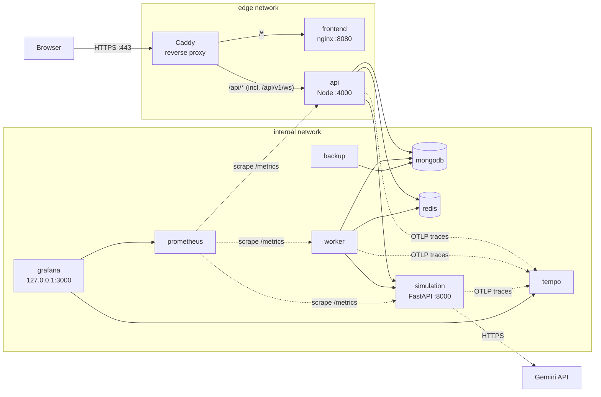

# Deployment and operations

Production is one Docker Compose project, `infrastructure/docker-compose.prod.yml`, on a single Linux server, deployed by GitHub Actions over SSH with images from GitHub Container Registry.



Only Caddy publishes public ports (80, 443). Grafana is bound to the server's `127.0.0.1:3000` (reach it with `ssh -L 3000:localhost:3000 <server>`). MongoDB, Redis, the API, worker, FastAPI, Prometheus and Tempo have no published ports; `/metrics` and the root `/health` are not routed by the proxy. The internal network is not `internal: true` because the simulation service calls the LLM API.

## CI/CD

| Workflow | Trigger | Does |
| --- | --- | --- |
| `.github/workflows/ci.yml` | every pull request (and as the first step of every deploy) | **node**: ESLint + Prettier, type checks, shared contract tests, backend tests (in-memory MongoDB, a Redis service container, the real FastAPI service for the contract and end-to-end tests), frontend tests, production build. **python**: Ruff on `simulation/` and `evaluation/`, a small model training run, the full pytest suite (fake LLM client, no keys). **contracts**: `npm run generate`, then fails if `shared/generated` or `shared/python` changed (stale types). **determinism**: the determinism and replay tests, replay of every retained engine version's fixture, and a CI-sized consistency evaluation. |
| `.github/workflows/deploy.yml` | push to `main`, or run manually | Runs CI, builds the four images and pushes them to `ghcr.io/<owner>/stackforge-{frontend,api,worker,simulation}:<commit sha>`, copies `infrastructure/` to the server, then runs `infrastructure/deploy/deploy.sh <sha>` there. Until the `DEPLOY_HOST` secret is set, the deploy job is skipped (shown as skipped, not failed); CI and the image builds still run. |

`deploy.sh` (run on the server; also runnable by hand) does, in order:

1. pull the release's images (the workflow logs the server in to GHCR with its short-lived job token, then logs out);
2. take a MongoDB backup;
3. run migrations with the new API image (`node dist/migrate.js`);
4. start the release (`up -d`), and reload Caddy and Prometheus so changed config files apply without downtime;
5. smoke-test `https://<SITE_ADDRESS>/api/v1/health/services` through the proxy (up to 30 tries, 4 s apart);
6. on failure: print the API's recent logs, start the previous release again, smoke-test it, and exit non-zero so the workflow fails. The deployed release is recorded in `infrastructure/.deployed-tag`.

Migrations run before the new release starts and are not undone by a rollback, so they must stay compatible with the previous release (add first, remove in a later release).

### What you set up once

**GitHub repository settings**

| Kind | Name | Value |
| --- | --- | --- |
| Secret | `DEPLOY_HOST` | Server hostname or IP. |
| Secret | `DEPLOY_USER` | SSH user on the server (in the `docker` group). |
| Secret | `DEPLOY_SSH_KEY` | Private key (e.g. ed25519) whose public key is in that user's `~/.ssh/authorized_keys`. Use a key made only for deploys. |
| Secret | `DEPLOY_KNOWN_HOSTS` | Output of `ssh-keyscan <server>`, so the workflow verifies the host key. |
| Secret (optional) | `LLM_API_KEY` | Gemini key for the manual **Prompt evals** workflow (`prompt-evals.yml`) only; CI uses the fake client. |
| Secret (optional) | `VITE_SENTRY_DSN` | Sentry DSN for the browser, baked into the frontend image. |
| Variable | `DEPLOY_PATH` | Directory on the server that holds `infrastructure/` (e.g. `/opt/stackforge`). |
| Environment | `production` | The deploy job runs in it; add required reviewers there if you want a manual approval before each deploy. |

Image pushes use the workflow's own `GITHUB_TOKEN` (`packages: write`); no registry secret is needed.

**On the server**

1. Install Docker Engine with the Compose plugin; add the deploy user to the `docker` group; open ports 80 and 443 (and 22 for SSH) only.
2. Point the domain's DNS A/AAAA record at the server (Caddy then obtains a certificate automatically).
3. `mkdir -p $DEPLOY_PATH/infrastructure` and create `$DEPLOY_PATH/infrastructure/.env.prod` from `infrastructure/.env.prod.example`: `SITE_ADDRESS` (the domain), `MONGO_PASSWORD`, `REDIS_PASSWORD`, `JWT_ACCESS_SECRET`, `GRAFANA_ADMIN_PASSWORD`, `LLM_API_KEY`, `EMAIL_API_KEY` and `EMAIL_FROM`, optionally `GOOGLE_CLIENT_ID`/`GOOGLE_CLIENT_SECRET` and `SENTRY_DSN`, and `BACKUP_DIR` (ideally a separate disk or a mounted remote volume). Generate secrets with `openssl rand -hex 32`. This file never leaves the server.
4. Make sure `curl` is installed (the smoke test uses it).

**Email (Gmail, no domain needed).** Set `EMAIL_PROVIDER=smtp` and:

1. Turn on 2-step verification for the Gmail account that will send the emails.
2. Create an App Password at https://myaccount.google.com/apppasswords (name it "Stack Forge"); Google shows 16 letters in groups of four.
3. Set `SMTP_USER` to the Gmail address, `SMTP_PASSWORD` to the App Password (spaces are ignored) and `EMAIL_FROM` to `Stack Forge <that address>`; `SMTP_HOST` and `SMTP_PORT` default to `smtp.gmail.com` and `465`.

Gmail allows about 500 emails a day from a personal account and may file the first messages under spam until recipients mark them as not spam. For larger volumes or your own sender domain, use Resend instead.

**Email (Resend).** Without working email, new users cannot verify their address and so cannot start simulations, and the API refuses to start in production with `EMAIL_PROVIDER=resend` and no `EMAIL_API_KEY`.

1. Create a Resend account and add your domain (a subdomain such as `mail.<domain>` keeps it separate from other mail).
2. Add the DNS records Resend shows (SPF `TXT`, DKIM `TXT`/`CNAME`, and the `MX` for bounces) at your DNS provider and wait until Resend marks the domain verified.
3. Create an API key with **Sending access** for that domain only; put it in `EMAIL_API_KEY`, and set `EMAIL_FROM` to an address on the verified domain, e.g. `Stack Forge <no-reply@mail.<domain>>`.

**Google sign-in (optional).** Leave `GOOGLE_CLIENT_ID` empty to hide the button.

1. In Google Cloud Console, create (or pick) a project; under **APIs & Services → OAuth consent screen** choose *External*, set the app name, support email and your domain as an authorized domain, with the scopes `openid`, `email` and `profile` (no sensitive scopes, so no Google review is needed). While the app is in *Testing*, only listed test users can sign in; publish it to allow everyone.
2. Under **Credentials → Create credentials → OAuth client ID**, choose *Web application* and add the authorized redirect URIs `https://<SITE_ADDRESS>/api/v1/auth/google/callback` and, for development, `http://localhost:4000/api/v1/auth/google/callback`. No JavaScript origins are needed (the flow runs on the server).
3. Put the client id and secret in `GOOGLE_CLIENT_ID` and `GOOGLE_CLIENT_SECRET`. The redirect URI is derived from `SITE_ADDRESS` by the compose file.

The first deploy has no previous release to roll back to; after that every deploy can roll back.

## Images

All images build from the repository root (they need `shared/`).

| Service | Dockerfile | Notes |
| --- | --- | --- |
| `frontend` | `frontend/Dockerfile` | Vite build with `VITE_API_URL=/api/v1` (and optional `VITE_SENTRY_DSN`, `VITE_RELEASE_SHA`), served by unprivileged nginx with an SPA fallback. |
| `api` | `backend/Dockerfile`, target `api` | Compiled TypeScript, production dependencies only, runs as `node`. Also holds `dist/migrate.js`. |
| `worker` | `backend/Dockerfile`, target `worker` | Same image, runs `dist/worker.js`; Prometheus metrics on `:9464`. |
| `simulation` | `simulation/Dockerfile` | Python 3.12 slim; trains the forecasting model during the build (seeded); non-root. Carries every retained engine version. |
| `proxy` | `caddy:2.8-alpine` + `infrastructure/Caddyfile` | HTTPS, HTTP→HTTPS redirect, HSTS; routes `/api/*` to the API, everything else to the frontend. |
| `mongodb`, `redis` | `mongo:7.0`, `redis:7.4-alpine` | Auth from `.env.prod`; named volumes; Redis append-only. |
| `backup` | `mongo:7.0` + `infrastructure/backup/` | Scheduled dumps (below). |
| `prometheus`, `tempo`, `grafana` | official images + `infrastructure/observability/` | Monitoring (below). |

## Running it by hand

```bash
cp infrastructure/.env.prod.example infrastructure/.env.prod      # fill in the secrets
docker compose -f infrastructure/docker-compose.prod.yml --env-file infrastructure/.env.prod build
docker compose -f infrastructure/docker-compose.prod.yml --env-file infrastructure/.env.prod run --rm --no-deps api node dist/migrate.js
docker compose -f infrastructure/docker-compose.prod.yml --env-file infrastructure/.env.prod up -d
curl -k https://localhost/api/v1/health/services                 # every dependency "ok"
```

Make the first admin: `docker compose ... exec api node dist/scripts/promote-admin.js user@example.com`.

## Data safety

- **Migrations** are versioned TypeScript files in `backend/src/migrations/` (append-only; applied ones are recorded in the `migrations` collection, with a lock so two deploys cannot migrate at once). `npm run migrate -w backend` in development; `node dist/migrate.js` (and `--status`) in the image; the deploy runs them. In production Mongoose does not build indexes on start; migrations do. See [database.md](database.md#indexes).
- **Backups**: the `backup` service dumps the `stackforge` database to `BACKUP_DIR` as `stackforge-<UTC timestamp>.archive.gz` every `BACKUP_INTERVAL_HOURS` (default 24) and deletes dumps older than `BACKUP_RETENTION_DAYS` (default 14). Every deploy also takes one first. Copy `BACKUP_DIR` off the server (e.g. a nightly `rsync` or object-storage sync) for real disaster recovery.
- **Restore** is one command, from the directory holding `infrastructure/`:

  ```bash
  infrastructure/backup/restore.sh                       # newest dump in BACKUP_DIR
  infrastructure/backup/restore.sh <path to a dump>      # a specific one (inside BACKUP_DIR)
  infrastructure/backup/restore.sh --now                 # take a dump now
  ```

  It stops the API and worker, restores with `--drop`, and starts them again. Verified on 2026-10-06 by restoring the newest dump into a brand-new, empty MongoDB (a separate Compose project): every collection's count matched the source.

## Observability

- **Metrics** (Prometheus, scraped every 15 s, kept 30 days): HTTP request rate, latency and status per route template for the API and FastAPI; turn queue depth by state; turn job duration by outcome; pipeline stage durations; LLM calls by outcome, tokens and latency; forecast latency.
- **Traces** (OpenTelemetry → Tempo, kept 7 days): one turn is one trace — the API request, the worker's job (its context travels in the job document), FastAPI's request, the pipeline and each of its seven stages, and every LLM call. Logs carry the `traceId`.
- **Dashboard**: Grafana provisions **Stack Forge overview** (`infrastructure/observability/grafana/dashboards/stackforge.json`) with all of the above and a table of recent turn traces linking to the trace view.
- **Errors**: Sentry, when `SENTRY_DSN` (services) and `VITE_SENTRY_DSN` (browser) are set. Events are tagged with `requestId` (and `jobId`, `simulationId`, `userId`, `traceId` where known) so they match log lines and traces; only unexpected errors are reported, not expected outages such as a dependency being down.

Development: `docker compose -f infrastructure/docker-compose.dev.yml --profile observability up -d` starts Prometheus (`:9090`), Tempo (OTLP on `:4318`) and Grafana (`:3000`, no login) beside MongoDB and Redis; set `OTEL_EXPORTER_OTLP_ENDPOINT=http://localhost:4318` for the services.

## Configuration

`infrastructure/.env.prod` (git-ignored, never copied by the workflow, never baked into an image):

| Variable | Used by | Notes |
| --- | --- | --- |
| `SITE_ADDRESS` | proxy, api | Domain or `localhost`. Sets `CORS_ORIGIN=https://<SITE_ADDRESS>`. |
| `MONGO_USER`, `MONGO_PASSWORD` | mongodb, api, worker, backup | URL-safe characters (hex). |
| `REDIS_PASSWORD` | redis, api, worker | URL-safe characters. |
| `JWT_ACCESS_SECRET` | api | 32+ characters. |
| `GRAFANA_ADMIN_PASSWORD` | grafana | Required. |
| `LLM_API_KEY` | simulation | Optional; without it agents use rules and advice is unavailable. |
| `EMAIL_PROVIDER` | api | `resend` (default), `smtp` (e.g. Gmail), or `none` to disable sending (users then cannot verify). `outbox` (files) is refused in production. |
| `EMAIL_API_KEY`, `EMAIL_FROM` | api | Resend API key and a sender on the verified domain; required with `resend`. |
| `SMTP_HOST`, `SMTP_PORT`, `SMTP_USER`, `SMTP_PASSWORD` | api | With `smtp`: server (default `smtp.gmail.com`:465, TLS; 587 uses STARTTLS), account and password (a Google App Password for Gmail). |
| `GOOGLE_CLIENT_ID`, `GOOGLE_CLIENT_SECRET` | api | Optional; both or neither. Redirect URI is `https://<SITE_ADDRESS>/api/v1/auth/google/callback`. |
| `LLM_USER_DAILY_TOKEN_QUOTA` | api, worker | Tokens per user per UTC day (default 200,000; 0 = no limit). At the limit turns run in rules mode. |
| `LLM_TURN_TOKEN_BUDGET` | simulation | Tokens per turn (default 12,000; 0 = no limit). |
| `SENTRY_DSN`, `VITE_SENTRY_DSN` | services, frontend build | Optional. |
| `BACKUP_DIR`, `BACKUP_INTERVAL_HOURS`, `BACKUP_RETENTION_DAYS` | backup | Defaults `./backups`, 24, 14. |
| `IMAGE_PREFIX`, `IMAGE_TAG` | all images | Set by the deploy; unset means locally built `stackforge-*:latest`. |

The compose file also sets `NODE_ENV=production`, `COOKIE_SECURE=true`, `TRUST_PROXY=1`, `APP_URL=https://<SITE_ADDRESS>` (links in emails), `REDIS_URL` for the simulation service (agent cache, Redis db 1), `APP_ENV=production` (FastAPI refuses `LLM_PROVIDER=stub` and disables its own `/docs`), and `OTEL_EXPORTER_OTLP_ENDPOINT=http://tempo:4318`.

## Verification status

Verified on this project's development machine (Docker Desktop 29.8.1, WSL 2, Windows 11) on 2026-10-06:

- All images build from a clean state, migrations apply to the existing database, and all eleven services start healthy; only the proxy (80/443) and Grafana (localhost) publish ports.
- Through `https://localhost`: `/api/v1/health/services` is `ok`, the old unversioned `/api/...` paths are 404, `/api/v1/docs` and both OpenAPI documents are served, `/metrics` is not reachable, and the NovaTech demo runs end to end.
- `deploy.sh` deployed a release (backup, migrations, smoke test passed) and, given a release whose API crashes on start, failed the smoke test, rolled back to the previous release and confirmed it healthy.
- One turn appeared in Tempo as a single trace of 12 spans across the API, worker and simulation service; every dashboard query returned data under load.
- A backup restored into an empty database with one command.

Not verifiable here: the GitHub workflows themselves (they need the repository on GitHub; both pass `actionlint`, and every command they run was run locally) and deployment to a real server.

On Windows, Docker Desktop needs the current WSL package (`wsl --version` must work) and may need a restart after updating it.
